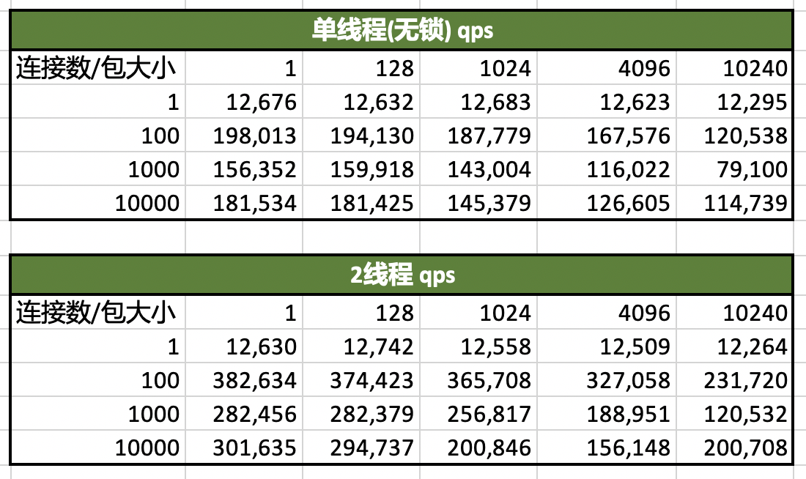

# loevent

一个简单的 c++ Epoll 网络库

## note

### server 工作流程: 

1. 初始化: 

  - 初始化 EventLoop
    - 初始化多个 SingleEventLoop, 初始化 IoEventMap
  - 初始化 TcpServer
    - 创建 Accepter
    - 把 TcpServer::onAcceptEvent 写入 EventLoop 的 IoEventMap
  - 给 TcpServer 绑定用户定义的 messageCallback_ 和 connectionCallback_

2. 新连接到来时

  - 触发 TcpServer::onAcceptEvent
    - 执行 accepter_->doAccept() 获取新连接的fd
    - 执行 newConnection 处理新连接
      - 创建 TcpConnection 对象
      - 执行用户传入的 TcpServer::connectionCallback_ 回调
      - 给 TcpConnection 绑定 TcpServer 的 messageCallback_ 回调
      - 把 TcpConnection::onRecv 写入 EventLoop 的 IoEventMap

3. 连接上的消息到来时

  - 触发 TcpConnection::onRecv
    - 处理tcp数据流, 把数据读到buffer, 传入 messageCallback_ 函数, 此时进入用户处理流程

### client 工作流程

1. 初始化 EventLoop
2. 初始化 TcpClient
3. setMessageCallback, setConnectionCallback, 绑定回调
4. TcpClient::run
  - 初始化 Connector
  - Connector::doConnect() (非阻塞)
  - 如果连接失败就创建 POLLOUT 事件, 推迟连接请求, 等待连接成功后再移除事件
5. 连接成功后执行 TcpClient::newConnection(), 与 server 流程类似

### 多线程设计

loevent网络库的多线程实现使用 one loop per thread 模型, 即每个线程有一个 event loop 循环. 这种方案每个loop之间相对独立, 且读写事件负载调度简单.

### buffer

数据读写需要应用层Buffer，read一次可能不能把内核缓冲区的数据全部读完，应该把已经读到的数据保存到应用层接收Buffer，由应用层接收Buffer解决粘包问题，write一次可能不能把所有数据全部写入内核缓冲区，应该有一个应用层发送Buffer，当数据未全部写入内核时会先被填充到应用层发送Buffer，然后在epoll的LT模式下关注POLLOUT事件。POLLOUT事件触发会从应用层发送Buffer取出数据写入内核缓冲区，直到应用层发送Buffer数据全部写完，最后取消关注POLLOUT事件。


## tcp benchmark

### localhost



## http benchmark

```sh
wrk -t4 -c1000 -d60s --latency "http://192.168.8.31:3000/api/v1/stream/?streamname=livestream1&edgename=edge240"
```

### localhost

```
Running 30s test @ http://192.168.8.31:3006/api/v1/stream/?streamname=livestream1&edgename=edge240
  2 threads and 1000 connections
  Thread Stats   Avg      Stdev     Max   +/- Stdev
    Latency     9.43ms   50.59ms   1.67s    99.52%
    Req/Sec    61.00k     6.48k   84.24k    79.43%
  3631548 requests in 30.04s, 1.16GB read
  Socket errors: connect 0, read 0, write 0, timeout 121
Requests/sec: 120895.03
Transfer/sec:     39.43MB
```

### 局域网多机

- 单线程(无锁) 1000连接

```
Running 1m test @ http://192.168.8.31:3007/api/v1/stream/?streamname=livestream1&edgename=edge240
  2 threads and 1000 connections
  Thread Stats   Avg      Stdev     Max   +/- Stdev
    Latency    28.05ms   38.09ms   1.95s    99.79%
    Req/Sec    12.96k     1.09k   16.78k    66.33%
  Latency Distribution
     50%   26.82ms
     75%   27.62ms
     90%   29.75ms
     99%   31.83ms
  1547438 requests in 1.00m, 504.71MB read
  Socket errors: connect 0, read 0, write 0, timeout 82
Requests/sec:  25752.24
Transfer/sec:      8.40MB
```

- 单线程(有锁) 1000连接
```
Running 1m test @ http://192.168.8.31:3007/api/v1/stream/?streamname=livestream1&edgename=edge240
  2 threads and 1000 connections
  Thread Stats   Avg      Stdev     Max   +/- Stdev
    Latency    57.59ms    6.99ms 491.84ms   72.61%
    Req/Sec     8.72k     0.94k   15.59k    76.00%
  Latency Distribution
     50%   58.03ms
     75%   61.55ms
     90%   66.00ms
     99%   70.21ms
  1041478 requests in 1.00m, 339.68MB read
Requests/sec:  17331.17
Transfer/sec:      5.65MB
```

- 双线程 1000连接
```
Running 20s test @ http://192.168.8.31:3007/api/v1/stream/?streamname=livestream1&edgename=edge240
  2 threads and 1000 connections
  Thread Stats   Avg      Stdev     Max   +/- Stdev
    Latency    28.16ms   85.38ms   1.80s    97.25%
    Req/Sec    26.81k     3.44k   43.27k    81.41%
  Latency Distribution
     50%   16.03ms
     75%   23.95ms
     90%   28.27ms
     99%  303.51ms
  1061530 requests in 20.00s, 346.23MB read
  Socket errors: connect 0, read 0, write 0, timeout 46
Requests/sec:  53072.29
Transfer/sec:     17.31MB
```
